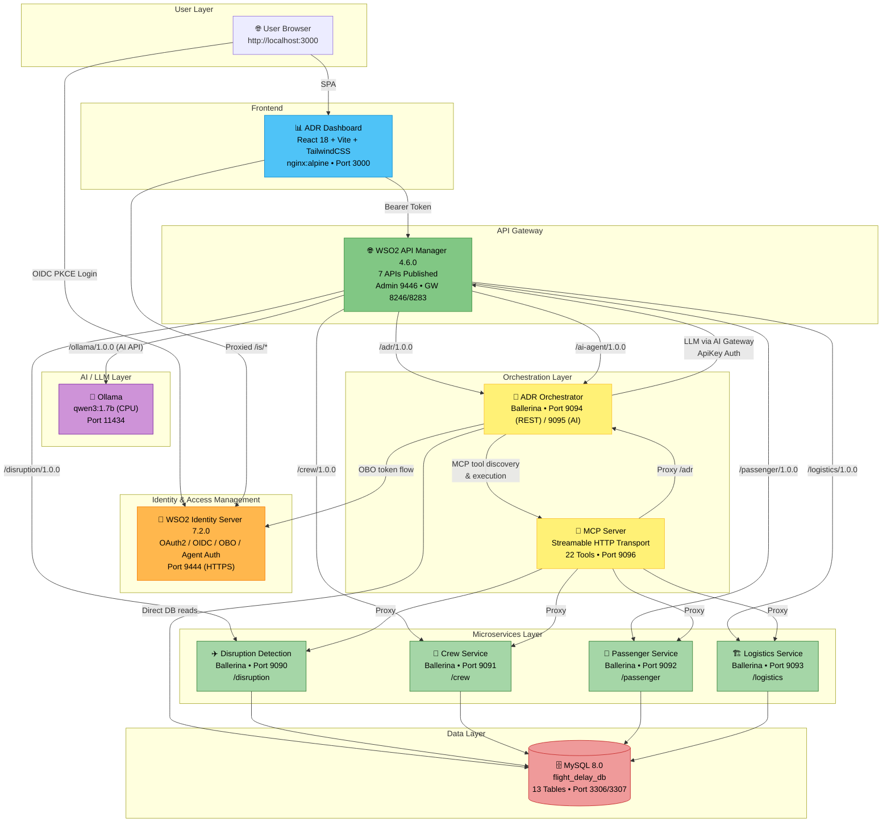
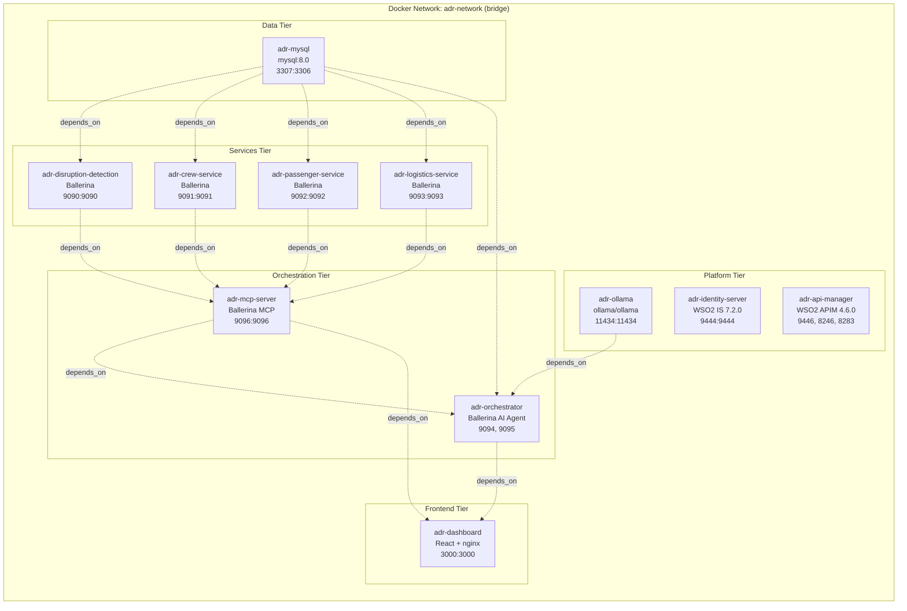
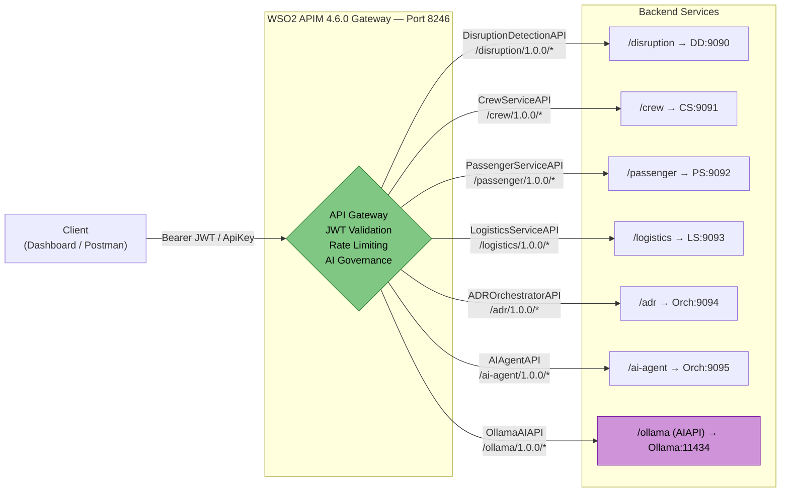
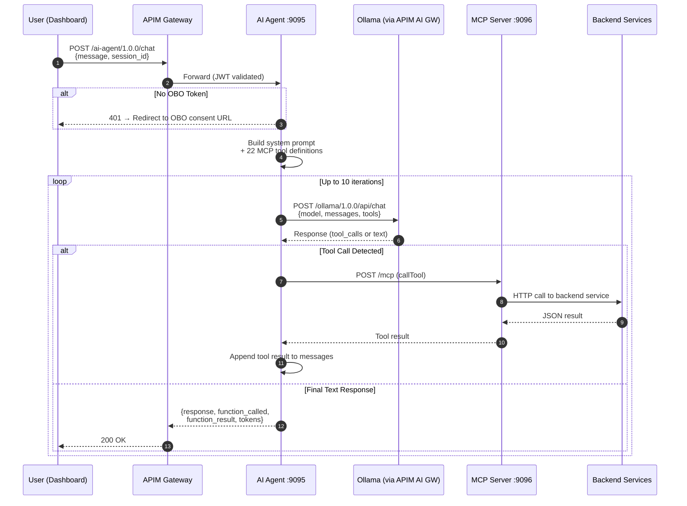
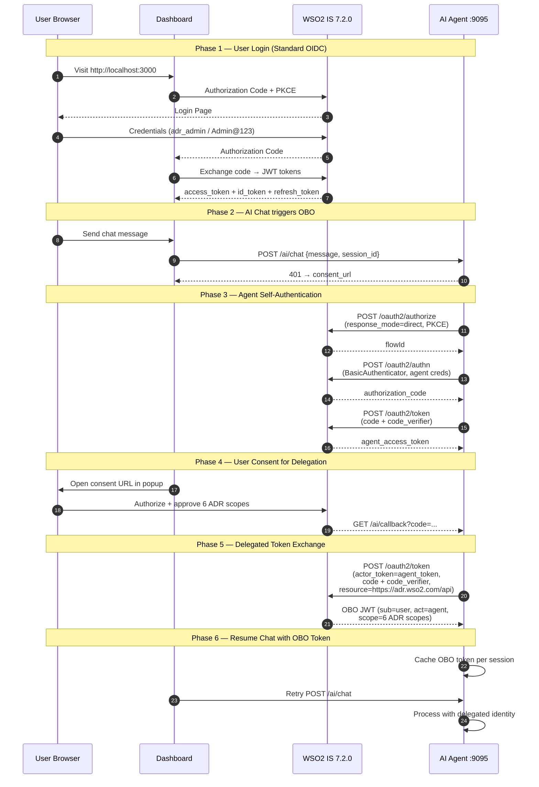
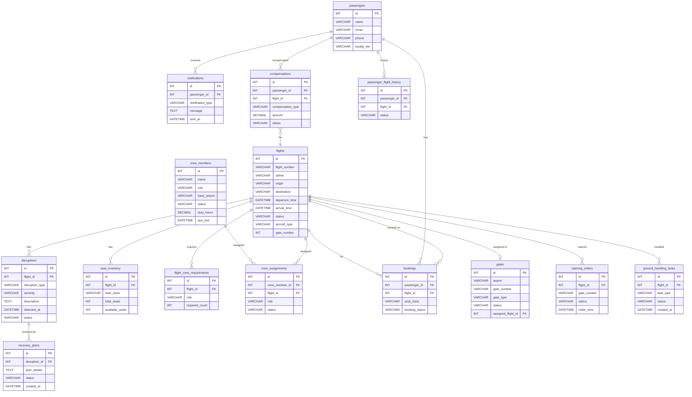
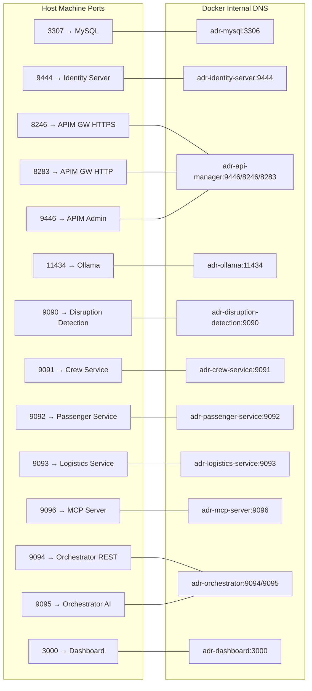

# Flight Delay Demo — Architecture Diagrams

> All diagrams below use [Mermaid](https://mermaid.js.org/) syntax.
> Render with any Mermaid-compatible viewer (GitHub, VS Code Mermaid Preview, mermaid.live, etc.)

---

## 1. System Overview — All Services & Connections

---

## 2. Docker Compose — Container Topology

---

## 3. API Manager — Published APIs & Gateway Routing

---

## 4. AI Agent — LLM Reasoning Loop with MCP Tools

---

## 5. OAuth2 / OBO (On-Behalf-Of) Token Flow

---

## 6. MCP Server — 22 Tools by Category

```mermaid
graph TB
    subgraph "MCP Server (Port 9096)"
        MCP["Streamable HTTP MCP Transport<br/>Stateless Sessions"]
    end

    subgraph "Recovery Tools (3)"
        T1["trigger_recovery"]
        T2["get_recovery_plan"]
        T3["list_recovery_plans"]
    end

    subgraph "Disruption Detection Tools (6)"
        T4["get_all_flights"]
        T5["get_flight_details"]
        T6["get_flight_seats"]
        T7["assess_disruption"]
        T8["get_active_delays"]
        T9["report_flight_delay"]
    end

    subgraph "Crew Management Tools (4)"
        T10["get_crew_assignments"]
        T11["get_available_crew"]
        T12["check_crew_compliance"]
        T13["reassign_crew"]
    end

    subgraph "Passenger Management Tools (5)"
        T14["get_passenger_bookings"]
        T15["get_alternative_flights"]
        T16["rebook_passenger"]
        T17["notify_passenger"]
        T18["process_compensation"]
    end

    subgraph "Logistics Tools (4)"
        T19["get_available_gates"]
        T20["assign_gate"]
        T21["redirect_catering"]
        T22["notify_ground_handling"]
    end

    MCP --- T1 & T2 & T3
    MCP --- T4 & T5 & T6 & T7 & T8 & T9
    MCP --- T10 & T11 & T12 & T13
    MCP --- T14 & T15 & T16 & T17 & T18
    MCP --- T19 & T20 & T21 & T22

    subgraph "Backend Routing"
        ORCH["Orchestrator :9094"]
        DD["Disruption Detection :9090"]
        CS["Crew Service :9091"]
        PS["Passenger Service :9092"]
        LS["Logistics Service :9093"]
    end

    T1 & T2 & T3 -->|"/adr"| ORCH
    T4 & T5 & T6 & T7 & T8 & T9 -->|"/disruption"| DD
    T10 & T11 & T12 & T13 -->|"/crew"| CS
    T14 & T15 & T16 & T17 & T18 -->|"/passenger"| PS
    T19 & T20 & T21 & T22 -->|"/logistics"| LS
```

---

## 7. Database Schema — Entity Relationships

---

## 8. ADR Recovery Pipeline — 5-Step Orchestration

```mermaid
flowchart TD
    Start(["POST /adr/recover<br/>{disruption_id}"]) --> Step1

    subgraph "Step 1 — Assess Disruption"
        Step1["GET /disruption/delays<br/>GET /disruption/{id}"]
        Step1 --> Step1a["GET /disruption/flights/{id}/assess"]
        Step1a --> Step1b{"Severity?"}
    end

    Step1b -->|"Low / Medium / High"| Step2

    subgraph "Step 2 — Crew Recovery"
        Step2["GET /crew/assignments/{flightId}"]
        Step2 --> Step2a["POST /crew/check-compliance"]
        Step2a --> Step2b{"Compliance OK?"}
        Step2b -->|"No"| Step2c["GET /crew/available"]
        Step2c --> Step2d["POST /crew/reassign"]
        Step2b -->|"Yes"| Step3
        Step2d --> Step3
    end

    subgraph "Step 3 — Passenger Recovery"
        Step3["GET /passenger/bookings/{flightId}"]
        Step3 --> Step3a["GET /passenger/alternatives/{flightId}"]
        Step3a --> Step3b["POST /passenger/rebook<br/>(seat-aware, priority by loyalty)"]
        Step3b --> Step3c["POST /passenger/notify"]
        Step3c --> Step3d["POST /passenger/compensation<br/>(smart: loyalty + no-alternatives aware)"]
    end

    Step3d --> Step4

    subgraph "Step 4 — Logistics Recovery"
        Step4["GET /logistics/gates/available/{airport}"]
        Step4 --> Step4a["POST /logistics/gates/assign"]
        Step4a --> Step4b["POST /logistics/catering/redirect"]
        Step4b --> Step4c["POST /logistics/ground-handling/notify"]
    end

    Step4c --> Step5

    subgraph "Step 5 — Save Recovery Plan"
        Step5["INSERT recovery_plans<br/>(all actions + results)"]
    end

    Step5 --> Done(["200 OK<br/>Recovery Plan"])

    style Start fill:#4FC3F7,stroke:#0288D1,color:#000
    style Done fill:#81C784,stroke:#2E7D32,color:#000
```

---

## 9. Deployment Automation — One-Click Flow

```mermaid
flowchart TD
    Start(["docker compose up --build -d"])
    Start --> Build["Build 10+ containers<br/>from Dockerfiles"]
    Build --> Wait["Wait for IS + APIM<br/>health checks"]
    Wait --> Script(["./create_apis.sh"])

    subgraph "create_apis.sh (~1051 lines)"
        Script --> IS_Config["WSO2 IS Configuration"]
        IS_Config --> IS1["Create OIDC App<br/>(ADRFlightDelaySPA)"]
        IS1 --> IS2["Create AI Agent<br/>(SCIM2 /scim2/Agents)"]
        IS2 --> IS3["Register API Resource<br/>(https://adr.wso2.com/api)<br/>6 ADR scopes"]
        IS3 --> IS4["Authorize App → API Resource<br/>(No Policy)"]
        IS4 --> IS5["Create App Roles<br/>(adr_admin, adr_operator)"]
        IS5 --> IS6["Create Demo Users<br/>(adr_admin, adr_operator)"]
        IS6 --> IS7["Register OBO Credentials<br/>for AI Agent"]

        IS7 --> APIM_Config["WSO2 APIM Configuration"]
        APIM_Config --> AP1["Register IS as Key Manager"]
        AP1 --> AP2["Publish 7 APIs<br/>(6 REST + 1 AIAPI)"]
        AP2 --> AP3["Register Ollama as<br/>AI Service Provider"]
        AP3 --> AP4["Create Application<br/>+ Subscribe all APIs"]
        AP4 --> AP5["Generate API Key"]

        AP5 --> Inject["Inject Runtime Config"]
        Inject --> INJ1["Config.docker.orchestrator.toml<br/>(agentId, agentSecret,<br/>appClientId, aiGatewayToken)"]
        INJ1 --> INJ2["auth-config.js<br/>(clientID, IS URLs, scopes)"]
        INJ2 --> Restart["Restart orchestrator<br/>+ dashboard containers"]
    end

    Restart --> Done(["✅ All services ready<br/>http://localhost:3000"])

    style Start fill:#4FC3F7,stroke:#0288D1,color:#000
    style Done fill:#81C784,stroke:#2E7D32,color:#000
    style Script fill:#FFF176,stroke:#FBC02D,color:#000
```

---

## 10. Network & Port Map

